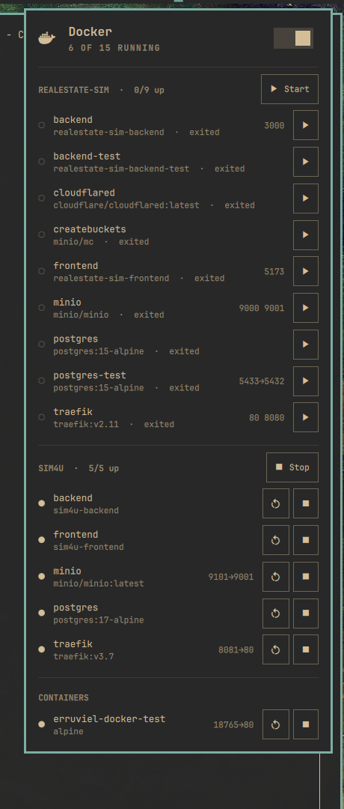

# OmiDocker

Docker containers and compose stacks on the [Omarchy](https://omarchy.org) bar.



A whale in the status bar, a control panel one click away:

- **Compose stacks** — containers grouped by `com.docker.compose.project`.
  Stack start runs `docker compose up -d` (recreates removed containers,
  picks up compose.yml changes); stack stop is a plain `docker stop`, never
  a destructive `down`. Update pulls published images (skipping build-only
  services) and redeploys changed services behind a confirmation.
- **Per-container controls** — start, stop, restart, unpause, and remove
  (stopped containers only, behind a confirm dialog).
- **Logs and shell** — one click opens a floating terminal with
  `docker logs -f` or an interactive `docker exec` shell. The inspector also
  opens `docker top`, `docker diff`, and raw `docker inspect` output.
- **Container inspector** — lifecycle/exit state, restart policy, health
  output, networks, mounts, image ID, and environment variable *names*.
  Environment values are deliberately never returned to the panel.
- **CPU/memory per container** — sampled with `docker stats` while the
  panel is open; the closed widget costs nothing.
- **Clickable ports** — a published port opens `http://localhost:<port>`
  in the browser.
- **Live updates** — the panel follows `docker events`, so work done in a
  terminal (compose up, stops, health flips) shows up immediately.
- **Health at a glance** — unhealthy containers turn urgent in the panel,
  put a badge dot on the bar icon, and raise a desktop notification when
  they flip (can be turned off).
- **Port-conflict hints** — a stopped container whose published host port is
  held by a running one is told exactly who is squatting on it.
- **Storage manager** — inspect images, volumes, and build cache; remove an
  individual unused image or volume; clean image/build data older than 24
  hours, 7 days, 30 days, or with no age filter. Image cleanup never touches
  containers or volumes. Volume deletion has a separate stronger warning.
- **Compose task runner** — validate each visible stack and run configured
  migrations, backups, tests, or other one-off commands via
  `docker compose run --rm` after confirmation.
- **Docker contexts** — switch between local and remote contexts inside the
  panel. Selection is passed with `docker --context`; the global Docker
  context is never changed.
- **Optional tool launchers** — discovers LazyDocker, Dive, Trivy, and Docker
  Scout. LazyDocker opens from Tools; image tools open from a container's
  inspector and inherit the selected context.
- **Daemon switch and autostart** — start/stop `docker.service` and toggle
  enable-at-boot for a local Unix-socket context, authorized through the
  regular polkit prompt. These controls are disabled for remote contexts.

## Install

```bash
omarchy plugin add https://github.com/Erruviel/omarchy-docker.git --enable
```

That's it. The plugin runs entirely unprivileged: container data and actions
go through the docker CLI (your `docker` group membership), and the daemon
switch calls `systemctl` as your user, which authenticates through polkit.
Nothing is installed outside the plugin directory, and nothing runs as root.

## Requirements

- `docker` CLI and, to see any containers, membership in the `docker` group:

  ```bash
  sudo usermod -aG docker $USER
  ```

  (log out and back in afterwards). Without it the panel explains what to do.
- `jq` (ships with Omarchy).

Optional integrations are detected automatically when `lazydocker`, `dive`,
or `trivy` is on `PATH`, or when the Docker Scout CLI plugin is registered.
None is required.

If Docker is not installed at all, the widget hides itself.

## Settings

In `~/.config/omarchy/shell.json`, on the widget entry:

| Key | Default | Meaning |
|-----|---------|---------|
| `interval` | `10` | Background poll interval in seconds while the panel is closed. Events refresh the panel regardless; this is the safety net. |
| `showCount` | `false` | Show the number of running containers next to the whale on the bar. |
| `notifyUnhealthy` | `true` | Desktop notification when a container turns unhealthy. |
| `tasks` | `[]` | One-off Compose task definitions; see below. |

```json
{ "id": "erruviel.docker", "interval": 30, "showCount": true }
```

### One-off tasks

Each task names a currently visible Compose project and service. Prefer a
command array so arguments are passed without shell parsing:

```json
{
  "id": "erruviel.docker",
  "tasks": [
    {
      "name": "Migrate database",
      "project": "myapp",
      "service": "web",
      "command": ["bin/rails", "db:migrate"]
    },
    {
      "name": "Backup database",
      "project": "myapp",
      "service": "db",
      "command": ["sh", "-lc", "pg_dump -U postgres app > /backups/app.sql"]
    }
  ]
}
```

String commands are supported and run as `sh -lc <command>`, but arrays are
safer whenever shell features are not needed. OmiDocker confirms every task
before starting its one-off container.

## Development

```bash
tests/test-helper.sh
omarchy plugin validate .
```

The helper test uses a fake Docker CLI, verifies context propagation and
argument quoting, and asserts that environment values cannot leak into panel
state. It never touches the real Docker daemon.

## Uninstall

```bash
omarchy plugin remove erruviel.docker
```

## License

MIT — see [LICENSE](LICENSE).
